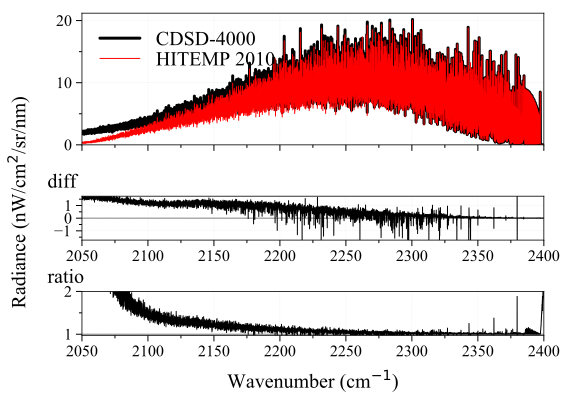

[](https://pypi.python.org/pypi/radis) [](https://pypistats.org/packages/radis) [](https://linkinghub.elsevier.com/retrieve/pii/S0022407318305867) [](https://linkinghub.elsevier.com/retrieve/pii/S0022407320310049) [](https://readthedocs.org/projects/radis/) [](https://radis.github.io/radis-lab/)
[](https://radis.github.io/slack-invite/) [](https://github.com/radis/radis/graphs/contributors) [](https://app.travis-ci.com/github/radis/radis) [](https://codecov.io/gh/radis/radis) [](https://github.com/radis/radis-benchmark) [](./License.md)

# [RADIS](https://radis.readthedocs.io/)

RADIS is a fast line-by-line code for high resolution infrared molecular spectra (emission / absorption,
equilibrium / non-LTE) based on HITRAN/HITEMP/ExoMol.
Atomic spectra from the NIST and Kurucz databases are also available.

RADIS includes post-processing tools to compare experimental spectra and spectra calculated
with RADIS or other spectral codes.

Full user documentation (advanced install and examples) are available on the [RADIS Website](http://radis.readthedocs.io/).

## Getting Started

### Install

Assuming you have Python installed with the [Anaconda](https://www.anaconda.com/download/) distribution you can use `pip`:

```
pip install radis
```

or `mamba` or `conda` via the conda-forge channel:

```
conda install radis -c conda-forge
```

**That's it!** You can now run your first example below.
If you encounter any issue, or to upgrade the package later, please refer to the
[detailed installation procedure](https://radis.readthedocs.io/en/latest/dev/developer.html#label-install).

### Quick Start

Calculate a CO equilibrium spectrum from the HITRAN database:

```python
from radis import calc_spectrum
s = calc_spectrum(1900, 2300,         # cm-1
                  molecule='CO',
                  isotope='1,2,3',
                  pressure=1.01325,   # bar
                  Tgas=700,           # K
                  mole_fraction=0.1,
                  path_length=1,      # cm
                  databank='hitran'   # or 'hitemp'
                  )
s.apply_slit(0.5, 'nm')       # simulate an experimental slit
s.plot('radiance')
```


### Advanced use

The Quick Start examples automatically download the line databases from [HITRAN-2016](https://radis.readthedocs.io/en/latest/references/references.html#hitran-2016), which is valid for temperatures below 700 K.
For *high temperature* cases, you may need to use other line databases such as [HITEMP-2010](https://radis.readthedocs.io/en/latest/references/references.html#hitemp-2010) (typically T < 2000 K) or [CDSD-4000](https://radis.readthedocs.io/en/latest/references/references.html#cdsd-4000) (T < 5000 K). HITEMP can also be downloaded
automatically, or can be downloaded manually and described in a `~/radis.json`
[Configuration file](https://radis.readthedocs.io/en/latest/lbl/lbl.html#label-lbl-config-file).

More complex [examples](https://radis.readthedocs.io/en/latest/examples.html#label-examples) will require to use the [SpectrumFactory](https://radis.readthedocs.io/en/latest/source/radis.lbl.factory.html#radis.lbl.factory.SpectrumFactory)
class, which is the core of RADIS line-by-line calculations.
[calc_spectrum](https://radis.readthedocs.io/en/latest/source/radis.lbl.calc.html#radis.lbl.calc.calc_spectrum) is a wrapper to [SpectrumFactory](https://radis.readthedocs.io/en/latest/source/radis.lbl.factory.html#radis.lbl.factory.SpectrumFactory)
for the simple cases.

### Compare with experiments

Experimental spectra can be loaded using the [experimental_spectrum](https://radis.readthedocs.io/en/latest/source/radis.spectrum.models.html#radis.spectrum.models.experimental_spectrum) function
and compared with the [plot_diff](https://radis.readthedocs.io/en/latest/source/radis.spectrum.compare.html#radis.spectrum.compare.plot_diff) function. For instance:

```python
from numpy import loadtxt
from radis import experimental_spectrum, plot_diff
w, I = loadtxt('my_file.txt').T    # assuming 2 columns
sexp = experimental_spectrum(w, I, Iunit='mW/cm2/sr/nm')
plot_diff(sexp, s)    # comparing with spectrum 's' calculated previously
```

Typical output of [plot_diff](https://radis.readthedocs.io/en/latest/source/radis.spectrum.compare.html#radis.spectrum.compare.plot_diff):

[](https://radis.readthedocs.io/en/latest/spectrum/spectrum.html#compare-two-spectra)

Refer to the [Examples](https://radis.readthedocs.io/en/latest/examples/examples.html) section for more examples, and to the
[Spectrum page](https://radis.readthedocs.io/en/latest/spectrum/spectrum.html) for more post-processing functions.

### GPU Acceleration

RADIS supports GPU acceleration for super-fast computation of spectra. Refer to [GPU Spectrum Calculation on RADIS](https://radis.readthedocs.io/en/latest/lbl/lbl.html#calculating-spectrum-using-gpu) for more details on GPU acceleration.

## Try online (no installation needed!)

### 🌱 Radis-app

A simple [web-app](https://radis.app/) for RADIS under development - [GitHub](https://github.com/suzil/radis-app)

[](https://radis.app/)

### 🔬 RADIS-lab

An [online environment](https://github.com/radis/radis-lab) for advanced spectrum processing and comparison with experimental data:

- no need to install anything
- use pre-configured line databases (HITEMP)
- upload your data files, download your results !

[](https://radis.github.io/radis-lab/)

See more [on GitHub](https://github.com/radis/radis-lab)

---

## Cite

Articles are available at [](https://linkinghub.elsevier.com/retrieve/pii/S0022407318305867) [](https://linkinghub.elsevier.com/retrieve/pii/S0022407320310049)

For reproducibility, do not forget to cite the line database used, and the spectroscopic constants
if running nonequilibrium calculations. See [How to cite?](https://radis.readthedocs.io/en/latest/references/references.html#cite)

---

## Developer Guide

### Contribute

Want to contribute to RADIS? Join the Slack community and we'll help you through the process.
Want to get started immediately? Nice. Have a look at the [Developer Guide](https://radis.readthedocs.io/en/latest/dev/developer.html).

[](https://github.com/radis/radis/graphs/contributors) [](https://radis.github.io/slack-invite/)

RADIS internals are also described in the [full documentation](https://radis.readthedocs.io/en/latest/index.html)

### License

The code is available on this repository under
[GNU LESSER GENERAL PUBLIC LICENSE (v3)](./LICENSE) [](./License.md)

---

## References

### Links

- Documentation: [](https://readthedocs.org/projects/radis/)

- Help: [](https://gitter.im/radis-radiation/community) [](https://radis.github.io/slack-invite/) [Q&A forum](https://groups.google.com/forum/#!forum/radis-radiation)

- Articles: [](https://linkinghub.elsevier.com/retrieve/pii/S0022407318305867) [](https://linkinghub.elsevier.com/retrieve/pii/S0022407320310049)

- Source Code: [](https://github.com/radis/radis/stargazers) [](https://github.com/radis/radis/graphs/contributors) [](./License.md)

- Test Status: [](https://app.travis-ci.com/github/radis/radis) [](https://codecov.io/gh/radis/radis) [](https://github.com/radis/radis-benchmark)

- PyPI Repository: [](https://pypi.python.org/pypi/radis) [](https://pypistats.org/packages/radis)

- Interactive Examples: [radis_examples](https://github.com/radis/radis-examples) [](https://github.com/radis/radis-examples) [](https://radis.github.io/radis-lab/)

- [Fitroom](https://github.com/radis/fitroom) (for advanced multidimensional fitting).

### Other Spectroscopic tools

See [awesome-spectra](https://github.com/erwanp/awesome-spectra) [](https://github.com/erwanp/awesome-spectra)

---

[](https://radis.readthedocs.io/)
