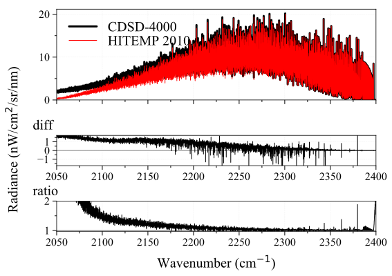

 | |badge_pypi|  |badge_pypistats| |badge_article1| |badge_article2| |badge_docs| |badge_binder|
 | |badge_slack| |badge_contributors| |badge_travis| |badge_coverage| |badge_code_quality| |badge_asv| |badge_license|

*****************************************
`RADIS <https://radis.readthedocs.io/>`__
*****************************************

RADIS is a fast line-by-line code for high resolution infrared molecular spectra (emission / absorption,
equilibrium / non-LTE) based on HITRAN/HITEMP/ExoMol.

It includes post-processing tools to compare experimental spectra and spectra calculated
with RADIS or other spectral codes.

User guide, install procedure and examples are available on the `RADIS Website <http://radis.readthedocs.io/>`__:

|badge_docs|

===============
Getting Started
===============

Install
-------

Assuming you have Python installed with the `Anaconda <https://www.anaconda.com/download/>`_ distribution just use::

    pip install radis -v

**That's it!** You can now run your first example below.
If you encounter any issue, or to upgrade the package later, please refer to the
`detailed installation procedure <https://radis.readthedocs.io/en/latest/dev/install.html#label-install>`__ .

Quick Start
-----------

Calculate a CO equilibrium spectrum from the HITRAN database, using the
`calc_spectrum <https://radis.readthedocs.io/en/latest/source/radis.lbl.calc.html#radis.lbl.calc.calc_spectrum>`__ function. Output is a
`Spectrum object <https://radis.readthedocs.io/en/latest/spectrum/spectrum.html#label-spectrum>`__: ::

    from radis import calc_spectrum
    s = calc_spectrum(1900, 2300,         # cm-1
                      molecule='CO',
                      isotope='1,2,3',
                      pressure=1.01325,   # bar
                      Tgas=700,           # K
                      mole_fraction=0.1,
                      path_length=1,      # cm
                      databank='hitran'   # or 'hitemp'
                      )
    s.apply_slit(0.5, 'nm')       # simulate an experimental slit
    s.plot('radiance')

.. figure:: https://radis.readthedocs.io/en/latest/_images/co_spectrum_700K.png
    :scale: 60 %

Advanced use
------------

The Quick Start examples automatically downloads the line databases from `HITRAN-2016 <https://radis.readthedocs.io/en/latest/references/references.html#hitran-2016>`__, which is valid for temperatures below 700 K.
For *high temperature* cases, you may need to use other line databases such as
`HITEMP-2010 <https://radis.readthedocs.io/en/latest/references/references.html#hitemp-2010>`__ (typically T < 2000 K) or `CDSD-4000 <https://radis.readthedocs.io/en/latest/references/references.html#cdsd-4000>`__ (T < 5000 K). HITEMP can also be downloaded
automatically, or can be downloaded manually and described in a ``~/radis.json``
`Configuration file <https://radis.readthedocs.io/en/latest/lbl/lbl.html#label-lbl-config-file>`__.

More complex `examples <https://radis.readthedocs.io/en/latest/examples.html#label-examples>`__ will require to use the `SpectrumFactory <https://radis.readthedocs.io/en/latest/source/radis.lbl.factory.html#radis.lbl.factory.SpectrumFactory>`__
class, which is the core of RADIS line-by-line calculations.
`calc_spectrum <https://radis.readthedocs.io/en/latest/source/radis.lbl.calc.html#radis.lbl.calc.calc_spectrum>`__ is a wrapper to `SpectrumFactory <https://radis.readthedocs.io/en/latest/source/radis.lbl.factory.html#radis.lbl.factory.SpectrumFactory>`__
for the simple cases.

Compare with experiments
------------------------

Experimental spectra can be loaded using the `experimental_spectrum <https://radis.readthedocs.io/en/latest/source/radis.spectrum.models.html#radis.spectrum.models.experimental_spectrum>`__ function
and compared with the `plot_diff <https://radis.readthedocs.io/en/latest/source/radis.spectrum.compare.html#radis.spectrum.compare.plot_diff>`__ function. For instance::

    from numpy import loadtxt
    from radis import experimental_spectrum, plot_diff
    w, I = loadtxt('my_file.txt').T    # assuming 2 columns
    sexp = experimental_spectrum(w, I, Iunit='mW/cm2/sr/nm')
    plot_diff(sexp, s)    # comparing with spectrum 's' calculated previously

Typical output of `plot_diff <https://radis.readthedocs.io/en/latest/source/radis.spectrum.compare.html#radis.spectrum.compare.plot_diff>`__:

Refer to the `Examples <https://radis.readthedocs.io/en/latest/examples/examples.html>`__ section for more examples, and to the
`Spectrum page <https://radis.readthedocs.io/en/latest/spectrum/spectrum.html>`__ for more post-processing functions.

GPU Acceleration
----------------

RADIS supports GPU acceleration for super-fast computation of spectra:

    from radis import SpectrumFactory
    from radis.tools.plot_tools import ParamRange

    sf = SpectrumFactory(
        2100,
        2400,  # cm-1
        molecule="CO2",
        isotope="1,2,3",
        wstep=0.002,
    )

    sf.fetch_databank("hitemp")

    s = sf.eq_spectrum_gpu_interactive(
        var="radiance",
        Tgas=ParamRange(300.0, 2500.0, 1100.0),  # K
        pressure=ParamRange(0.1, 2, 1),  # bar
        mole_fraction=ParamRange(0, 1, 0.8),
        path_length=ParamRange(0, 1, 0.2),  # cm
        slit_FWHM=ParamRange(0, 1.5, 0.24),  # cm-1
        emulate=False,  # runs on GPU
        plotkwargs={"nfig": "same", "wunit": "nm"},
    )

.. image:: https://raw.githubusercontent.com/dcmvdbekerom/radis/gpu_widget_new_branch/docs/examples/GPU_spectrum.png

Refer to :ref:`GPU Spectrum Calculation on RADIS <label_radis_gpu>` for more details on GPU acceleration.
---------------------------------------------------------------------

=======================================
🌱 Try online (no installation needed!)
=======================================

radis-app
---------

A simple web-app for RADIS under development.

.. image:: https://user-images.githubusercontent.com/16088743/103406077-b2457100-4b59-11eb-82c0-e4de027a91c4.png
    :target: https://radis.app/
    :alt: https://radis.app/

See more `on GitHub <https://github.com/radis/radis-ui>`__

RADIS-lab
---------

An online environment for advanced spectrum processing and comparison with experimental data :

- no need to install anything
- use pre-configured line databases (HITEMP)
- upload your data files, download your results !

.. image:: https://user-images.githubusercontent.com/16088743/103448773-7d8f0200-4c9e-11eb-8bf1-ce3385519b77.png
    :target: https://radis.github.io/radis-lab/
    :alt: https://radis.github.io/radis-lab/

🌱 Try it : https://radis.github.io/radis-lab/

See more `on GitHub <https://github.com/radis/radis-lab>`__

---------------------------------------------------------------------

====
Cite
====

Articles are available at |badge_article1| |badge_article2|

For reproducibility, do not forget to cite the line database used, and the spectroscopic constants
if running nonquilibrium  calculations. See `How to cite? <https://radis.readthedocs.io/en/latest/references/references.html#cite>`__

---------------------------------------------------------------------

===============
Developer Guide
===============

Contribute
----------

Want to contribute to RADIS ? Join the Slack community and we'll help you through the process.
Want to get started immediatly ? Nice. Have a look at the `CONTRIBUTING.md <./CONTRIBUTING.md>`__ guide.

|badge_contributors| |badge_slack|

You need to know more about Spectroscopy ? We're working on Tutorials to
make spectroscopy available to everyone. For the moment, join the
`Slack channel <https://radis-radiation.slack.com/archives/C01N7R9728M>`__ .

Architecture
------------

RADIS internals are described in the `Developer Guide <https://radis.readthedocs.io/en/latest/dev/developer.html>`__

.. image:: https://radis.readthedocs.io/en/latest/_images/RADIS_flow_chart.svg
     :target:   https://radis.readthedocs.io/en/latest/dev/architecture.html#label-dev-architecture
     :alt: https://radis.readthedocs.io/en/latest/_images/RADIS_flow_chart.svg

License
-------

The code is available on this repository under
`GNU LESSER GENERAL PUBLIC LICENSE (v3) <./LICENSE>`_   |badge_license|

Support
-------

If encountering any problem, first refer to the list of known
`Issues <https://github.com/radis/radis/issues?utf8=%E2%9C%93&q=is%3Aissue>`__ on GitHub.
We appreciate your feedback and suggestions!

For any question, please join the discussion channel on Gitter |badge_gitter|, Slack |badge_slack|
or the `Q&A Forum <https://groups.google.com/forum/#!forum/radis-radiation>`__

Finally, you can also suggest or vote for new features below:

.. image:: https://feathub.com/radis/radis?format=svg
   :target: https://feathub.com/radis/radis

---------------------------------------------------------------------

==========
References
==========

Links
-----

- Documentation: |badge_docs|

- Help: |badge_gitter| |badge_slack|  `Q&A forum <https://groups.google.com/forum/#!forum/radis-radiation>`__

- Articles: |badge_article1| |badge_article2|

- Source Code: |badge_stars| |badge_contributors| |badge_license|

- Test Status: |badge_travis| |badge_coverage| |badge_asv|

- PyPi Repository: |badge_pypi|  |badge_pypistats|

- Interactive Examples: `radis_examples <https://github.com/radis/radis-examples>`__ |badge_examples| |badge_binder|

- `Fitroom <https://github.com/radis/fitroom>`__ (for advanced multidimensional fitting).

Other Spectroscopic tools
-------------------------

See `awesome-spectra <https://github.com/erwanp/awesome-spectra>`__   |badge_awesome_spectra|

--------

.. image:: https://github.com/radis/radis/blob/master/docs/radis_ico.png
    :target: https://radis.readthedocs.io/
    :scale: 50 %
    :alt: RADIS logo

.. |CO2| replace:: CO\ :sub:`2`

.. |badge_docs| image:: https://readthedocs.org/projects/radis/badge/
                :target: https://radis.readthedocs.io/en/latest/?badge=latest
                :alt: Documentation Status

.. |badge_article1| image:: https://zenodo.org/badge/doi/10.1016/j.jqsrt.2018.09.027.svg
                   :target: https://linkinghub.elsevier.com/retrieve/pii/S0022407318305867
                   :alt: Article

.. |badge_article2| image:: https://zenodo.org/badge/doi/10.1016/j.jqsrt.2020.107476.svg
                   :target: https://linkinghub.elsevier.com/retrieve/pii/S0022407320310049
                   :alt: Spectral Synthesis Algorithm

.. |badge_stars| image:: https://img.shields.io/github/stars/radis/radis.svg?style=social&label=Star
                :target: https://github.com/radis/radis/stargazers
                :alt: GitHub

.. |badge_contributors| image:: https://img.shields.io/github/contributors/radis/radis.svg
                        :target: https://github.com/radis/radis/graphs/contributors
                        :alt: Contributors

.. |badge_license| image:: https://img.shields.io/badge/License-LGPL3-blue.svg
                   :target: ./License.md
                   :alt: License

.. |badge_travis| image:: https://img.shields.io/travis/radis/radis.svg
                  :target: https://travis-ci.com/radis/radis
                  :alt: Tests

.. |badge_coverage| image:: https://codecov.io/gh/radis/radis/branch/develop/graph/badge.svg
                    :target: https://codecov.io/gh/radis/radis
                    :alt: Coverage

.. |badge_code_quality| image:: https://img.shields.io/lgtm/grade/python/g/radis/radis.svg?logo=lgtm&logoWidth=18)
                  :target: https://lgtm.com/projects/g/radis/radis/alerts
                  :alt: Code Quality

.. |badge_asv| image:: http://img.shields.io/badge/benchmarked%20by-asv-blue.svg?style=flat
                  :target: https://github.com/radis/radis-benchmark
                  :alt: Benchmarks

.. |badge_pypi| image:: https://img.shields.io/pypi/v/radis.svg
                :target: https://pypi.python.org/pypi/radis
                :alt: PyPI

.. |badge_pypistats| image:: https://img.shields.io/pypi/dw/radis.svg
                     :target: https://pypistats.org/packages/radis
                     :alt: Downloads

.. |badge_examples| image:: https://img.shields.io/github/stars/radis/radis-examples.svg?style=social&label=Star
                :target: https://github.com/radis/radis-examples
                :alt: Examples

.. |badge_awesome_spectra| image:: https://img.shields.io/github/stars/erwanp/awesome-spectra.svg?style=social&label=Star
                           :target: https://github.com/erwanp/awesome-spectra
                           :alt: Examples

.. |badge_binder| image:: https://mybinder.org/badge.svg
                  :target: https://radis.github.io/radis-lab/
                  :alt: https://radis.github.io/radis-lab/

.. |badge_gitter| image:: https://badges.gitter.im/Join%20Chat.svg
                  :target: https://gitter.im/radis-radiation/community
                  :alt: Gitter

.. |badge_slack| image:: https://img.shields.io/badge/slack-join-green.svg?logo=slack
                  :target: https://radis.github.io/slack-invite/
                  :alt: Slack
