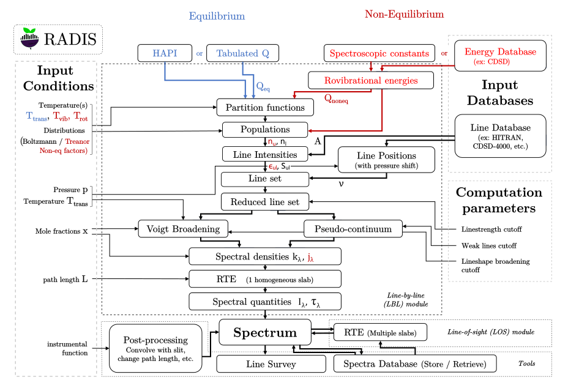

.. _label_dev_architecture:
============
Architecture
============

The RADIS modules are organized with the following flow chart

-------------------------------------------------------------------------

The upper part shows the successive calculation steps of the Line-by-Line module. 
These steps appear clearly in the source code of the 
:py:meth:`~radis.lbl.factory.SpectrumFactory.eq_spectrum` and 
:py:meth:`~radis.lbl.factory.SpectrumFactory.non_eq_spectrum` methods of the 
:py:class:`~radis.lbl.factory.SpectrumFactory`. 

Most methods are written in inherited class with the following inheritance scheme:
    
:py:class:`~radis.lbl.loader.DatabankLoader` > :py:class:`~radis.lbl.base.BaseFactory` > 
:py:class:`~radis.lbl.broadening.BroadenFactory` > :py:class:`~radis.lbl.bands.BandFactory` > 
:py:class:`~radis.lbl.factory.SpectrumFactory` > :py:class:`~radis.lbl.parallel.ParallelFactory`

-------------------------------------------------------------------------

The Input Conditions in the left part, and the Computation Parameters on the right part,
are the input parameters of the different RADIS front-ends:

- :py:func:`~radis.lbl.calc.calc_spectrum` for the simple cases.
- :py:class:`~radis.lbl.factory.SpectrumFactory` with :py:meth:`~radis.lbl.factory.SpectrumFactory.eq_spectrum` 
  and :py:meth:`~radis.lbl.factory.SpectrumFactory.non_eq_spectrum` for the other cases.
- :py:class:`~radis.lbl.parallel.ParallelFactory` with :py:meth:`~radis.lbl.parallel.ParallelFactory.eq_spectrum` 
  and :py:meth:`~radis.lbl.parallel.ParallelFactory.non_eq_spectrum` for parallel processing.

-------------------------------------------------------------------------

The Input databases are either automatically downloaded from [HITRAN-2016]_, or defined
locally in a :ref:`Configuration file <label_lbl_config_file>`

-------------------------------------------------------------------------

The bottom part includes the post-processing modules of RADIS, in particular:

- The various methods associated with the :py:class:`~radis.spectrum.spectrum.Spectrum` class. 

- The :ref:`label_los_index` module 

- The :py:class:`~radis.tools.line_survey.LineSurvey` tool.

- The :py:class:`~radis.tools.database.SpecDatabase` tool. 
