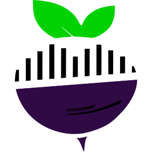
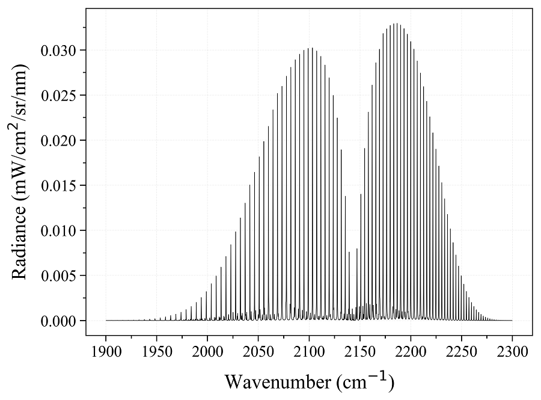

.. RADIS documentation master file, created by
   sphinx-quickstart on Tue Feb  6 03:32:15 2018.
   You can adapt this file completely to your liking, but it should at least
   contain the root `toctree` directive.

*****
RADIS
*****

RADIS is a fast :ref:`line-by-line code <label_line_by_line>` for high resolution infrared molecular spectra (emission / absorption,
equilibrium / nonequilibrium).

It also includes :ref:`post-processing tools <label_spectrum>` to compare experimental spectra and spectra calculated
with RADIS, or with other spectral codes.

===============
Getting Started
===============

Install
=======

Assuming you have Python installed with the `Anaconda <https://www.anaconda.com/download/>`_ distribution just use::

    pip install radis

**That's it!** You can now run your first example below.
If you encounter any problem or if you need to upgrade, please refer to the
:ref:`detailed installation procedure <label_install>`. If you don't have a Python
environment, try :ref:`🌱 RADIS Online <label_radis_online>` first !

.. _label_first_example:

Quick Start
===========

Calculate a CO equilibrium spectrum from the [HITRAN-2020]_ database, using the
:py:func:`~radis.lbl.calc.calc_spectrum` function. Lines are downloaded automatically
using Astroquery (based on [HAPI]_). Output is a
:ref:`Spectrum object <label_spectrum>`: ::

    from radis import calc_spectrum
    s = calc_spectrum(1900, 2300,         # cm-1
                      molecule='CO',
                      isotope='1,2,3',
                      pressure=1.01325,   # bar
                      Tgas=700,           # K
                      mole_fraction=0.1,
                      path_length=1,      # cm
                      databank='hitran',  # or 'hitemp', 'geisa', 'exomol'
                      )
    s.apply_slit(0.5, 'nm')       # simulate an experimental slit
    s.plot('radiance')

Calculate a CO *nonequilibrium* spectrum from the HITRAN database, with
arbitrary :py:mod:`~astropy.units` (on your first call, this will compute and
store the CO(X) rovibrational energies): ::

    from astropy import units as u
    s2 = calc_spectrum(1900 / u.cm, 2300 / u.cm,
                      molecule='CO',
                      isotope='1,2,3',
                      pressure=1.01325 * u.bar,
                      Tvib=700 * u.K,
                      Trot=300 * u.K,
                      mole_fraction=0.1,
                      path_length=1 * u.cm,
                      databank='hitran',  # or 'hitemp', 'geisa', 'exomol'
                      )
    s2.apply_slit(0.5, 'nm')
    s2.plot('radiance', nfig='same')    # compare with previous

Experimental spectra can be loaded using the :py:func:`~radis.spectrum.models.experimental_spectrum` function
and compared with the :py:func:`~radis.spectrum.compare.plot_diff` function. For instance::

    from numpy import loadtxt
    from radis import experimental_spectrum, plot_diff
    w, I = loadtxt('my_file.txt').T    # assuming 2 columns
    sexp = experimental_spectrum(w, I, Iunit='mW/cm2/sr/nm')
    plot_diff(sexp, s)    # comparing with a spectrum 's' calculated previously

Refer to the :ref:`Spectrum object guide <label_spectrum>` for more post-processing functions
(:ref:`rescale <label_spectrum_rescale>` , :ref:`crop<label_spectrum_offset_crop>`,
:ref:`remove baselines<label_spectrum_remove_baseline>`, :ref:`store<label_spectrum_store>`,
:ref:`combine along the line-of-sight <label_spectrum_line_of_sight>`,
:ref:`identify each line <label_spectrum_linesurvey>`,
:ref:`manipulate multiple spectra at once <label_spectrum_database>`, etc.)

More examples
=============

.. minigallery:: radis.Spectrum

The Quick Start examples automatically downloaded the line databases from [HITRAN-2020]_, which is valid for temperatures below 700 K.
For *high temperature* cases, you may need to use :ref:`other line databases <label_line_databases>` such as
[HITEMP-2010]_ (typically T < 2000 K) or [CDSD-4000]_ (T < 5000 K). These databases must be described in a ``~/radis.json``
:ref:`Configuration file <label_lbl_config_file>`.

.. note::

  📣 starting from radis==0.9.30 you can also download HITEMP and ExoMol directly. Just use ``databank='hitemp'``
  or ``databank='exomol'`` in the initial example. This will automatically download, unzip and setup the database
  files in a ~/.radisdb folder.

More complex :ref:`examples <label_examples>` will require to use the :py:class:`~radis.lbl.factory.SpectrumFactory`
class, which is the core of RADIS line-by-line calculations.

Refer to the :ref:`Examples <label_examples>` and :ref:`Example Gallery <sphx_glr_auto_examples>` sections for more examples, and to the
:ref:`User Documentation <label_line_by_line>` for more details on the code.
You can also ask questions on the `Q&A Forum <https://groups.google.com/forum/#!forum/radis-radiation>`__
or on the community chats on `Gitter <https://gitter.im/radis-radiation/community>`__ or
`Slack <https://radis.github.io/slack-invite/>`__

|badge_gitter| |badge_slack|

In the browser (no installation needed!)
========================================

Alternatively, you can also run RADIS directly in the browser with the
`RADIS Interactive Examples <https://github.com/radis/radis-examples#interactive-examples>`_ project.
For instance, run the Quick Start example on the link below:

.. image:: https://mybinder.org/badge.svg
    :target: https://mybinder.org/v2/gh/radis/radis-examples/master?filepath=first_example.ipynb
    :alt: https://mybinder.org/v2/gh/radis/radis-examples/master?filepath=first_example.ipynb

Or use :ref:`🌱 RADIS-lab <label_radis_lab>` to start a full online environment for advanced spectrum processing
and comparison with experimental data :

.. image:: https://mybinder.org/badge.svg
    :target: https://mybinder.org/v2/gh/radis/radis-lab/main?urlpath=lab/tree/compare_with_experiment.ipynb
    :alt: https://mybinder.org/v2/gh/radis/radis-lab/main?urlpath=lab/tree/compare_with_experiment.ipynb

Cite
====

RADIS is built on the shoulders of many state-of-the-art packages and databases. If using RADIS
to compute spectra, make sure you cite all of them, for proper reproducibility and acknowledgement of
the work ! See :ref:`How to cite? <label_cite>`

---------------------------------------------------------------------

=======
Content
=======

- :ref:`The Line-by-line (LBL) module<label_line_by_line>`

  This is the core of RADIS: it calculates the spectral densities for a homogeneous
  slab of gas, and returns a :class:`~radis.spectrum.spectrum.Spectrum` object. Calculations
  are performed within the :class:`~radis.lbl.factory.SpectrumFactory` class.
  :py:func:`~radis.lbl.calc.calc_spectrum` is a high-level wrapper to
  :class:`~radis.lbl.factory.SpectrumFactory` for most simple cases.

- :ref:`Line-of-sight (LOS) module<label_los_index>`

  This module takes several :class:`~radis.spectrum.spectrum.Spectrum` objects
  as input and combines then along the line-of-sight (:func:`~radis.los.slabs.SerialSlabs`)
  or at the same spatial position (:func:`~radis.los.slabs.MergeSlabs`), to reproduce
  line-of-sight experiments. The module allows combination of Spectra such as::

      s_line_of_sight = (s_plasma_CO2 // s_plasma_CO) > (s_room_absorption)

- :ref:`The Spectrum object guide<label_spectrum>`

  This module contains the :class:`~radis.spectrum.spectrum.Spectrum` object itself, with several methods that can be
  applied after the Spectrum was calculated: rescale, apply instrumental slit function,
  store or retrieve from a Spectrum database, plot or compare with another Spectrum object.

---------------------------------------------------------------------

* :ref:`modindex`

---------------------------------------------------------------------

.. toctree::
   :maxdepth: 2
   :hidden:

   features/features
   lbl/lbl
   spectrum/spectrum
   los/los
   examples/examples
   auto_examples/index
   examples/hitran-spectra
   online/online
   dev/developer
   references/references
   api

---------------------------------------------------------------------

`Q&A Forum <https://groups.google.com/forum/#!forum/radis-radiation>`__

|badge_pypi|  |badge_pypistats| |badge_article| |badge_docs| |badge_license| |badge_contributors| |badge_travis| |badge_coverage| |badge_binder| |badge_gitter| |badge_slack|

|badge_stars|

.. |badge_docs| image:: https://readthedocs.org/projects/radis/badge/
                :target: https://radis.readthedocs.io/en/latest/?badge=latest
                :alt: Documentation Status

.. |badge_article| image:: https://zenodo.org/badge/doi/10.1016/j.jqsrt.2018.09.027.svg
                   :target: https://linkinghub.elsevier.com/retrieve/pii/S0022407318305867
                   :alt: Article

.. |badge_stars| image:: https://img.shields.io/github/stars/radis/radis.svg?style=social&label=GitHub
                :target: https://github.com/radis/radis/stargazers
                :alt: GitHub

.. |badge_contributors| image:: https://img.shields.io/github/contributors/radis/radis.svg
                        :target: https://github.com/radis/radis/graphs/contributors
                        :alt: Contributors

.. |badge_license| image:: https://img.shields.io/badge/License-LGPL3-blue.svg
                   :target: ./License.md
                   :alt: License

.. |badge_travis| image:: https://img.shields.io/travis/radis/radis.svg
                  :target: https://travis-ci.com/radis/radis
                  :alt: Tests

.. |badge_coverage| image:: https://codecov.io/gh/radis/radis/branch/master/graph/badge.svg
                    :target: https://codecov.io/gh/radis/radis
                    :alt: Coverage

.. |badge_pypi| image:: https://img.shields.io/pypi/v/radis.svg
                :target: https://pypi.python.org/pypi/radis
                :alt: PyPI

.. |badge_pypistats| image:: https://img.shields.io/pypi/dw/radis.svg
                     :target: https://pypistats.org/packages/radis
                     :alt: Downloads

.. |badge_examples| image:: https://img.shields.io/github/stars/radis/radis-examples.svg?style=social&label=Star
                :target: https://github.com/radis/radis-examples
                :alt: Examples

.. |badge_awesome_spectra| image:: https://img.shields.io/github/stars/erwanp/awesome-spectra.svg?style=social&label=Star
                           :target: https://github.com/erwanp/awesome-spectra
                           :alt: Examples

.. |badge_binder| image:: https://mybinder.org/badge.svg
                  :target: https://mybinder.org/v2/gh/radis/radis-examples/master?filepath=radis_online.ipynb
                  :alt: https://mybinder.org/v2/gh/radis/radis-examples/master?filepath=radis_online.ipynb

.. |badge_gitter| image:: https://badges.gitter.im/Join%20Chat.svg
                  :target: https://gitter.im/radis-radiation/community
                  :alt: Gitter

.. |badge_slack| image:: https://img.shields.io/badge/slack-join-green.svg?logo=slack
                  :target: https://radis.github.io/slack-invite/
                  :alt: Slack

