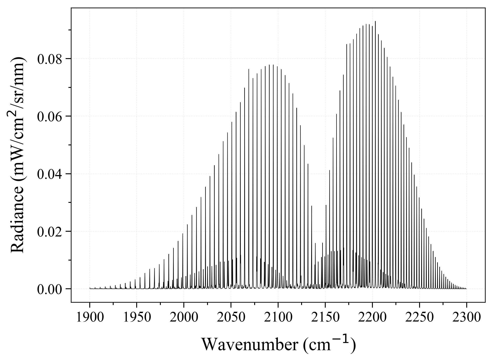

.. RADIS documentation master file, created by
   sphinx-quickstart on Tue Feb  6 03:32:15 2018.
   You can adapt this file completely to your liking, but it should at least
   contain the root `toctree` directive.

.. |logo_png| image:: radis_ico.png

=====
RADIS
=====

A nonequilibrium infrared emission and absorption line-by-line code.

===============
Getting Started
===============

Install
-------

Assuming you have Python installed with the `Anaconda <https://www.anaconda.com/download/>`_ distribution just use::

    pip install radis 
    
**That's it!** Now run your :ref:`first example <label_first_example>`.
If you encounter any issue, please follow the detailed 
installation procedure and requirements below:

.. toctree::
   :maxdepth: 2

   install

.. _label_first_example:
Quick Start
-----------

Calculate a CO equilibrium spectrum from the HITRAN database, using the
:py:func:`~radis.lbl.calc.calc_spectrum` function::

    from radis import calc_spectrum
    s = calc_spectrum(1900, 2300,         # cm-1
                      molecule='CO',
                      isotope='1,2,3',
                      pressure=1.01325,   # bar
                      Tgas=1000,          # K
                      mole_fraction=0.1, 
                      path_length=1,      # cm
                      )
    s.apply_slit(0.5, 'nm')
    s.plot('radiance')

Calculate a CO *nonequilibrium* spectrum from the HITRAN database
(on your first call, this will calculate and cache the CO(X) rovibrational
energies) ::

    s2 = calc_spectrum(1900, 2300,         # cm-1
                      molecule='CO',
                      isotope='1,2,3',
                      pressure=1.01325,   # bar
                      Tvib=1000,          # K
                      Trot=300,           # K
                      mole_fraction=0.1, 
                      path_length=1,      # cm
                      )
    s2.apply_slit(0.5, 'nm')
    s2.plot('radiance', nfig='same')    # compare with previous
    
The Quick Start examples automatically download the line databases from [HITRAN-2016]_, which is valid for temperatures below 700 K. 
For *high temperature* cases, you may need to use other line databases such as 
[HITEMP-2010]_ (typically T < 2000 K) or [CDSD-4000]_ (T < 5000 K). These databases must be described in a ``~/.radis`` 
:ref:`Configuration file <label_lbl_config_file>`. 

More complex :ref:`Examples <label_examples>` will require to use the :py:class:`~radis.lbl.factory.SpectrumFactory`
class, which is the core of RADIS line-by-line calculations. 
:py:func:`~radis.lbl.calc.calc_spectrum` is a wrapper to :py:class:`~radis.lbl.factory.SpectrumFactory`
for the simple cases. 

Refer to the :ref:`Examples <label_examples>` section for more examples. 

In the browser
--------------

Alternatively, you can also run RADIS directly in the browser with the  
`RADIS Interactive Examples <https://github.com/radis/radis-examples#interactive-examples>`_ project. 
No installation needed. For instance, run the Quick Start example on the link below:

.. image:: https://mybinder.org/badge.svg 
    :target: https://mybinder.org/v2/gh/radis/radis-examples/master?filepath=first_example.ipynb
    :alt: https://mybinder.org/v2/gh/radis/radis-examples/master?filepath=first_example.ipynb

---------------------------------------------------------------------

==================
User documentation
==================

.. include:: description.rst

See the :ref:`Architecture <label_dev_architecture>` section for an overview of the RADIS calculation 
steps. 

Features
--------
   
.. toctree::

   :maxdepth: 2
   
   features
   

Line-by-line (LBL) module
-------------------------

This is the core of RADIS: it calculates the spectral densities for a homogeneous
slab of gas, and returns a :class:`~radis.spectrum.spectrum.Spectrum` object. Calculations
are performed within the :class:`~radis.lbl.factory.SpectrumFactory` class. 

.. toctree::
   :maxdepth: 2
   
   lbl/index

   
Line-of-sight (LOS) module
--------------------------

This module takes several :class:`~radis.spectrum.spectrum.Spectrum` objects 
as input and combines then along the line-of-sight (:func:`~radis.los.slabs.SerialSlabs`) 
or at the same spatial position (:func:`~radis.los.slabs.MergeSlabs`), to reproduce 
line-of-sight experiments. The module allows combination of Spectra such as::

    s_line_of_sight = (s_plasma_CO2 // s_plasma_CO) > (s_room_absorption) 

.. toctree::
   :maxdepth: 2
   
   los/index

   
The Spectrum class
------------------

This module contains the :class:`~radis.spectrum.spectrum.Spectrum` object itself, with several methods that can be 
applied after the Spectrum was calculated: rescale, apply instrumental slit function, 
store or retrieve from a Spectrum database, plot or compare with another Spectrum object. 

.. toctree::
   :maxdepth: 2
   
   spectrum/spectrum
   spectrum/howto

   
Tools
-----

Different tools to work with Spectrum objects

.. toctree::
   :maxdepth: 2
   
   tools/line_survey
   tools/database

Interfaces
----------

RADIS includes parsers and interfaces to read and return data in different formats: 

.. toctree::
   :maxdepth: 2
   
   io/parsers
   io/databases
   io/thermo

Examples
--------
   
.. toctree::
   :maxdepth: 2
   
   examples

   
---------------------------------------------------------------------

===============
Developer Guide
===============

Architecture
------------
   
.. toctree::
   :maxdepth: 2
   
   dev/architecture
   
Tests
-----
   
.. toctree::
   :maxdepth: 2
   
   dev/test
   
---------------------------------------------------------------------

==========
References
==========
   
Spectroscopic constants 
-----------------------

.. toctree::
    :maxdepth: 2
    
    db/constants

Bibliography
------------
   
.. toctree::
    :maxdepth: 2
    
    references

Source code and Licence
-----------------------

The code is available for use and modifications on `GitHub <https://github.com/radis/radis>`__
under a `GNU LESSER GENERAL PUBLIC LICENSE (v3) <https://github.com/radis/radis/blob/master/LICENSE>`__,
i.e., that modifications must remain public and under LGPLv3. 

Cite
----

If using RADIS for your work, cite the line-by-line code as [RADIS-2018]_, alongside the references of the line databases 
used (for instance, [HITRAN-2016]_, [HITEMP-2010]_ or [CDSD-4000]_ ).

If running nonequilibrium calculations, do not forget to mention the reference of the spectroscopic constants used 
in the calculatation of the rovibrational energies (for instance, see the 
:ref:`references for the RADIS built-in constants <_label_db_spectroscopic_constants>`)

Access Module Methods
---------------------

* :ref:`genindex`
* :ref:`modindex`
* :ref:`search`

