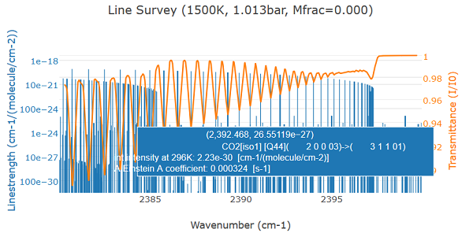

***********
Line Survey
***********

Line survey is defined by the :class:`~radis.tools.line_survey.LineSurvey` class. 
It can be accessed directly by the Spectrum :meth:`~radis.spectrum.spectrum.Spectrum.line_survey`
method::

An example using the :class:`~radis.lbl.factory.SpectrumFactory` to generate a spectrum::

    sf = SpectrumFactory(
                         wavenum_min=2380,
                         wavenum_max=2400,
                         mole_fraction=400e-6,
                         path_length=100,  # cm
                         isotope=[1],
                         db_use_cached=True) 
    sf.load_databank('HITRAN-CO2-TEST')
    s = pl.eq_spectrum(Tgas=1500)
    s.apply_slit(0.5)
    s.line_survey(overlay='transmittance', barwidth=0.01)

Output:

